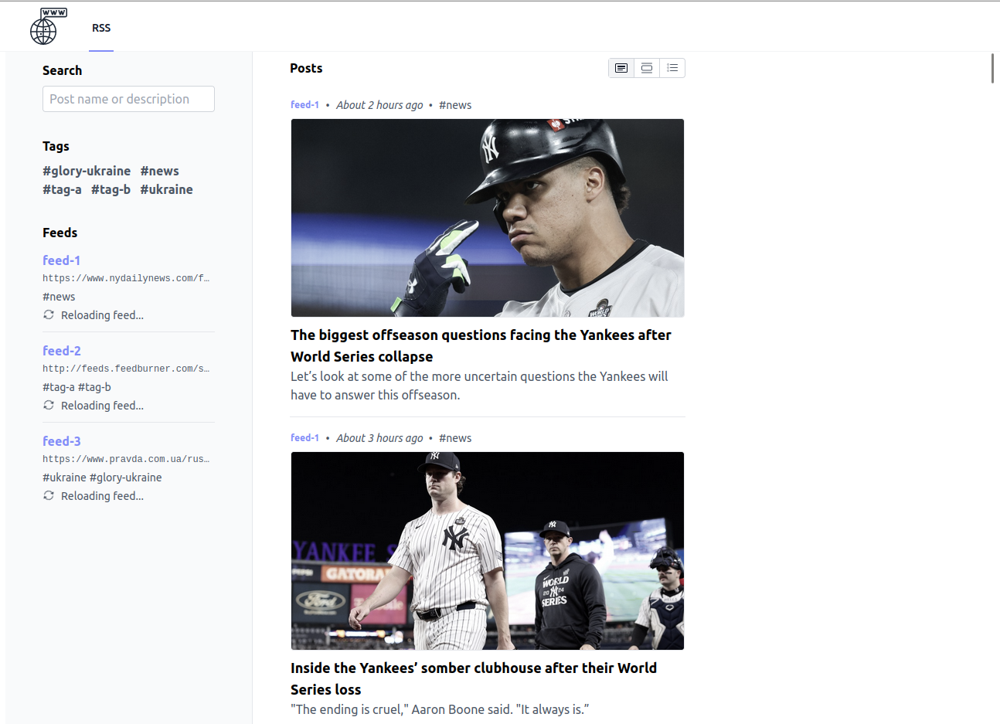
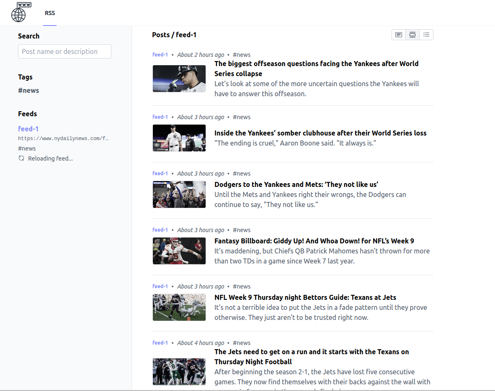
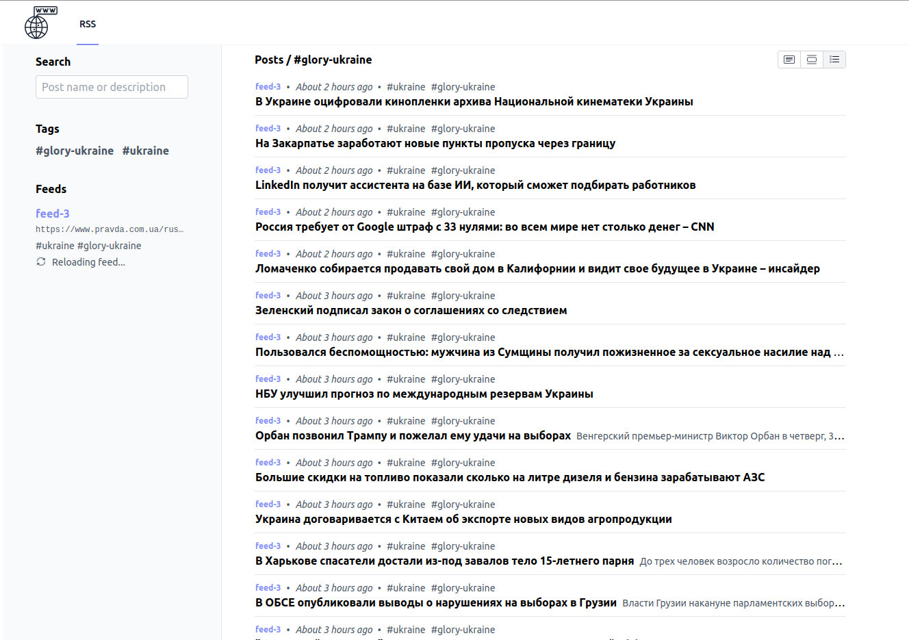
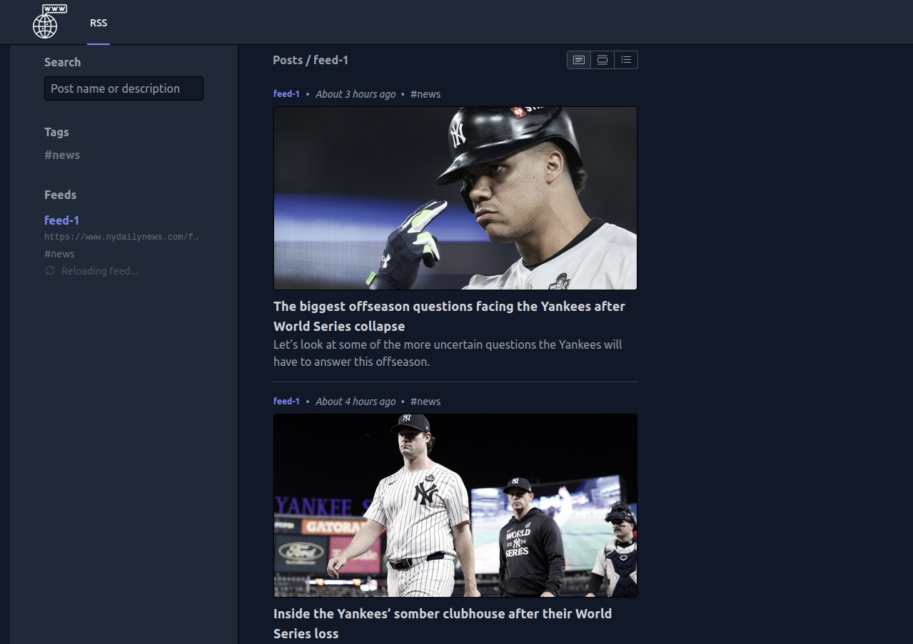
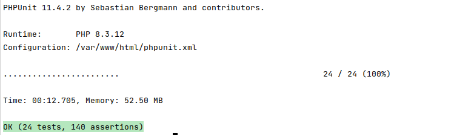

# RSS

A simple, opinionated, Laravel RSS feed aggregator.

## Features

The following features are built into the application:

- Supports RSS and ATOM formats.
- Regular auto-fetching of RSS feeds.
    - Every hour by default, configurable.
- Custom feed names.
- Feed-based tags for categorization.
- 3 different post layout modes (card, list, compact).
- Fetching of page open-graph images.
- Feeds managed via a single plaintext file.
- System-based dark/light theme.
- Post title/description search.
- Ready-to-use docker image.
- Mobile screen compatible.
- Built-in support to prune old post data.

## Screenshots

<table>
	<tbody>
		<tr>
			<td width="20%">
				Card View
				
			</td>
			<td width="20%">
				List View
				
			</td>
			<td width="20%">
				Compact View
				
			</td>
			<td width="20%">
				Dark Mode
				
			</td>
            <td width="20%">
                PHPUnit Tests
                
            </td>
		</tr>
	</tbody>
</table>

## Live Demo

https://rss.4in.top

## Docker Usage

Port 80 is exposed by default for application access. This application does not support HTTPS, for that you should
instead use a proxy layer such as nginx.

#### Docker Compose Example

In the below `docker-compose.yml` example, the application will be accessible at http://localhost on the host

```yml
---
version: "3"
services:
    app:
        build:
            context: './docker/php/8.3'
            dockerfile: Dockerfile
            args:
                USERNAME: '${USERNAME:-www-data}'
        extra_hosts:
            - 'host.docker.internal:host-gateway'
        ports:
            - '${APP_PORT:-80}:80'
            - '${VITE_PORT:-5173}:${VITE_PORT:-5173}'
        environment:
            IGNITION_LOCAL_SITES_PATH: '${PWD}'
        env_file:
            - .env
        volumes:
            - '.:/var/www/html'
            - './docker/logs/supervisor:/var/log/supervisor'
```

## Feed Configuration

Feed configuration is handled by a plaintext file on the host system.
By default this configuration would be located in a `./storage/feeds.txt` file.

The format of this file can be seen below:

```txt
https://feed.url.com/feed.xml feed-name #tag-a #tag-b
https://example.com/feed.xml Example #updates #news

# Lines starting with a hash are considered comments.
# Empty lines are fine and will be ignored.
```

## App Configuration

The application allows some configuration through variables.
These can be set via the `.env` file or, when using docker, via environment variables.

```shell
# The name of the application.
# Only really shown in the title/browser-tab.
APP_NAME=RSS

# The path to the config file.
# Defaults to `storage/feeds.txt` within the application folder.
RSS_FEEDS_FILE=/var/www/html/storage/feeds.txt

# Enable or disable the loading of post thumbnails.
# Does not control them within the UI, but controls the fetching
# when posts are fetched.
# Defaults to true.
APP_LOAD_POST_THUMBNAILS=true

# The number of minutes before a feed is considered outdated and
# therefore should be updated upon request.
# This effectively has a minimum of 5 minutes in the docker setup.
APP_FEED_UPDATE_FREQUENCY=60

# The number of days to wait before a post should be pruned.
# Uses the post published_at time to determine lifetime.
# Setting this to false disables any auto-pruning.
# If active, pruning will auto-run daily.
# Defaults to false (No pruning) 
APP_PRUNE_POSTS_AFTER_DAYS=30

#User agent of the bot that is used to obtain data
RSS_BOT_USER_AGENT=RssFetcher/1.0.0
```

## Usage Behind a Reverse Proxy

When using behind a reverse proxy, ensure common forwarding headers are set so that the application can properly detect
the right host and path to use.
The below shows a sub-path proxy config location block for nginx. Note the `X-Forwarded-Prefix` header to make the
application aware of sub-path usage.

```nginx
location /rss/ {
    proxy_pass http://container-ip:80/;
    proxy_set_header Host              $host;
    proxy_set_header X-Real-IP         $remote_addr;
    proxy_set_header X-Forwarded-For   $proxy_add_x_forwarded_for;
    proxy_set_header X-Forwarded-Proto $scheme;
    proxy_set_header X-Forwarded-Host  $host;
    proxy_set_header X-Forwarded-Port  $server_port;
    proxy_set_header X-Forwarded-Prefix "/rss/";
    proxy_redirect off;
}
```

## Manual Install

Manually installing the application is not recommended unless you are performing development work on the project.
Instead, use of the docker image is advised.

This project is based upon Laravel so the requirements and install process are much the same.
You will need git, PHP, composer and NodeJS installed. Installation would generally be as follows:

```shell
# Clone down and enter the project
git clone https://github.com/Martyn911/rss.git
cd rss

# Install PHP dependencies via composer
# This will check you meet the minimum PHP version and extensions required.
composer install

# Copy config, generate app key, migrate database & link storage
cp .env.example .env
php artisan key:generate
php artisan migrate
php artisan storage:link

# Install JS dependencies & build CSS/JS
npm install
npm run build
```

For a production server you'd really want to have a webserver active to server the `public` directory and handle PHP.
You'd also need a process to run the laravel queue system in addition to a cron job to run the schedule.

On a development system, These can be done like so:

```shell
# Serve the app
php artisan serve

# Watch the queue
php artisan queue:listen

# Work the schedule
php artisan schedule:work

# Parse default config list
php artisan rss:parse-feeds-file

# Update feeds
php artisan rss:update-outdated-feeds

# Delete old posts
php artisan rss:prune-posts --days=30
```

## Development

This project uses [PHPUnit](https://phpunit.de/) for testing. Tests will use their own in-memory SQLite instance. Tests
can be ran like so:

```shell
./vendor/bin/phpunit
```

[PHP CS Fixer](https://github.com/FriendsOfPHP/PHP-CS-Fixer) is used for formatting. This can be ran like so:

```bash
./vendor/bin/php-cs-fixer fix
```

A command is built-in to test RSS feeds where needed. This will just provide a boolean yes/no fetchable status result,
but you can run it with debugging with breakpoints for further diagnosis:

```bash
php artisan rss:test-feed https://www.nydailynews.com/feed/
```

## Attribution

This is primarily built using the following great projects and technologies:

- [Laravel](https://laravel.com/) - [MIT License](https://github.com/laravel/framework/blob/10.x/LICENSE.md)
- [InertiaJS](https://inertiajs.com/) - [MIT License](https://github.com/inertiajs/inertia/blob/master/LICENSE)
- [TailwindCSS](https://tailwindcss.com/)
    - [MIT License](https://github.com/tailwindlabs/tailwindcss/blob/master/LICENSE)
- [Vue.js](https://vuejs.org/) - [MIT License](https://github.com/vuejs/vue/blob/main/LICENSE)
- [PHPUnit](https://phpunit.de/) - [BSD-3-Clause-Like](https://github.com/sebastianbergmann/phpunit/blob/main/LICENSE)
- [Bootstrap Icons](https://icons.getbootstrap.com/) - [MIT License](https://github.com/twbs/icons/blob/main/LICENSE.md)
